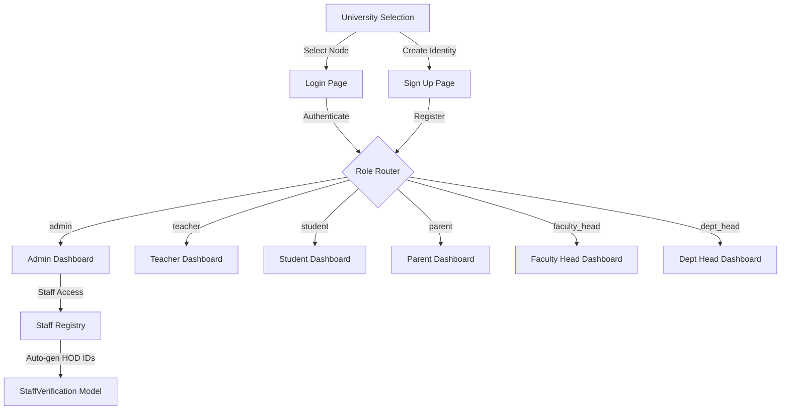

# UniCore v4.5 — Final Release Notes

> [!IMPORTANT]
> This document summarizes all changes made during the finalization pass of UniCore v4.5.

## 🎨 Branding & Identity

| Element | Before | After |
|---------|--------|-------|
| Product Name | EduBridge | **UniCore** |
| Tagline | — | Academic Governance Network |
| Attribution | — | **Powered by NexaVision** |
| First Page Title | Generic heading | **UniCore** (8xl gradient text) |

### Where Branding Appears
- ✅ **University Selection Page** — Large "UniCore" title with gradient
- ✅ **Login Page** — Footer with NexaVision
- ✅ **Sign Up Page** — Footer with NexaVision
- ✅ **Loading Spinner** (index.html) — UniCore + NexaVision
- ✅ **App.jsx Loader** — UniCore branding
- ✅ **Error Boundary** — UniCore + NexaVision
- ✅ **404 Page** — UniCore + NexaVision
- ✅ **Admin Sidebar Footer** — UniCore Protocol + NexaVision
- ✅ **Browser Tab Title** — "UniCore — University Management System"

---

## 🐛 Bugs Fixed

| File | Issue | Fix |
|------|-------|-----|
| `LoginPage.jsx` | `Floating3DObject` component undefined (causes crash) | Removed references; uses `Floating3DAsset` only |
| `LoginPage.jsx` | `FiStar` icon used but not imported | Added to imports |
| `SignUpPage.jsx` | `HiAcademicCap`, `FiStar`, `FiCpu`, `FiBookOpen`, `FiShield` used but not imported | Added all missing imports |
| `AdminLayout.jsx` | `FiShield` used in nav items but not imported | Added to imports |
| `SignUpPage.jsx` | Inconsistent form styling (mix of old large and new compact) | Standardized all inputs to compact aesthetic |
| `index.css` | Body still using `--cream-bg` variable (light theme) | Migrated to `#0c0c0e` dark graphite |

---

## 🌑 Dark Graphite Theme Migration

### Global CSS (`index.css`)
- Body background: `#0c0c0e` (dark graphite)
- Font: `Inter` (clean, modern)
- Removed all cream/beige background gradients
- `.bg-ambient-light` now uses dark base with subtle amber glow
- `.bg-organic` now uses dark base with amber radials
- Scrollbar: Thinner (6px), dark-themed (`white/10`)

### Loading States
- `index.html` splash screen: Dark with amber spinner + "UniCore" text
- `App.jsx` Loader: Dark with amber spinner + UniCore branding
- Error Boundary: Dark card with amber accents

---

## 🏗️ Architecture Summary

---

## 📋 Files Modified in Final Pass

| File | Changes |
|------|---------|
| `UniversitySelectPage.jsx` | UniCore title, NexaVision footer, balanced grid |
| `LoginPage.jsx` | Bug fixes, NexaVision footer, UniCore branding |
| `SignUpPage.jsx` | Bug fixes, standardized styling, NexaVision footer |
| `AdminLayout.jsx` | FiShield import, NexaVision sidebar footer |
| `NotFound.jsx` | Dark theme, UniCore branding, NexaVision footer |
| `App.jsx` | Dark loader, dark error boundary, NexaVision |
| `index.html` | Dark loading screen, UniCore branding |
| `index.css` | Full dark theme migration, scrollbar update |

---

> [!TIP]
> The system is now ready for production testing. All entry points, error states, and navigation surfaces display consistent UniCore branding with NexaVision attribution.
